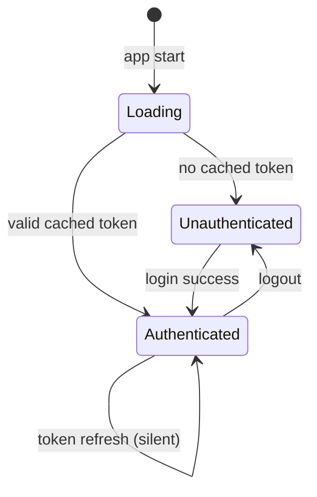
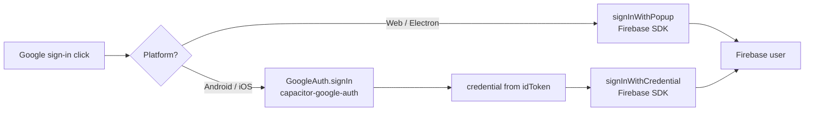

# Design Document: auth-and-roles

## Overview

This feature replaces the stub `AuthContext` with a real Firebase Authentication layer and adds role-based access control (RBAC) to the Game Zone monitoring app. The system supports two sign-in methods (phone OTP and Google OAuth), two roles (`admin` and `user`), and works identically across web/PWA, Android (Capacitor), iOS (Capacitor), and Electron.

The core design principle is **minimal surface area**: Firebase handles identity; the app handles role persistence in the existing `storageAdapter` (localStorage / Capacitor Preferences). No backend is added — roles are stored locally and seeded from Firebase custom claims when available.

### Key Design Decisions

| Decision | Choice | Rationale |
|---|---|---|
| Identity provider | Firebase Auth | Cross-platform SDK, phone OTP + Google OAuth built-in |
| Role storage | `storageAdapter` key `gamezone_user_role` | Consistent with existing data layer, works offline |
| Google OAuth on native | `@codetrix-studio/capacitor-google-auth` | Required for Android/iOS native Google sign-in |
| reCAPTCHA | Firebase invisible reCAPTCHA | Required by Firebase phone auth |
| Route protection | React Router wrapper components | Idiomatic React Router 6 pattern |
| Role promotion | Settings page UI (admin only) | No backend needed; stored locally |

---

## Architecture

```mermaid
graph TD
    A[App.jsx] --> B[AuthProvider]
    B --> C{isLoadingAuth?}
    C -->|yes| D[LoadingScreen]
    C -->|no| E{isAuthenticated?}
    E -->|no| F[/login route]
    E -->|yes| G[AppRoutes]
    G --> H[ProtectedRoute]
    H --> I[Layout + Outlet]
    I --> J[AdminRoute]
    J --> K[Analytics / Expenses]
    I --> L[Regular Pages]
    L --> M[RoleGuard]
    M --> N[Conditional UI]

    B --> O[Firebase Auth SDK]
    O --> P[Phone OTP]
    O --> Q[Google OAuth]
    B --> R[storageAdapter\ngamezone_user_role]
```

### Auth State Machine



### Platform-Specific Google OAuth Flow



---

## Components and Interfaces

### Files to Create

| File | Purpose |
|---|---|
| `src/lib/firebase.js` | Firebase app init + auth instance export |
| `src/lib/AuthContext.jsx` | Replace stub — real Firebase Auth integration |
| `src/components/ProtectedRoute.jsx` | Redirects unauthenticated users to `/login` |
| `src/components/AdminRoute.jsx` | Redirects non-admin users to `/` with toast |
| `src/components/RoleGuard.jsx` | Conditionally renders children by role |
| `src/pages/Login.jsx` | Login page (phone OTP + Google OAuth) |

### Files to Modify

| File | Change |
|---|---|
| `src/App.jsx` | Add `/login` route outside Layout; wrap routes with `ProtectedRoute` |
| `src/components/Layout.jsx` | Filter `navDefs` by role; add logout button |
| `src/pages/Settings.jsx` | Wrap pricing form in `RoleGuard role="admin"`; add role promotion UI |
| `src/pages/Dashboard.jsx` | Wrap P&L cards, earnings stat, and nav links in `RoleGuard role="admin"` |
| `src/pages/Consoles.jsx` | Wrap Add/Edit/Delete actions in `RoleGuard role="admin"` |
| `src/pages/Players.jsx` | Wrap Add/Delete actions in `RoleGuard role="admin"` |
| `src/i18n/locales/en.js` | Add auth translation keys |
| `src/i18n/locales/am.js` | Add auth translation keys (Amharic) |
| `.env.example` | Document required `VITE_FIREBASE_*` variables |

### AuthContext Interface

```js
// Value shape exposed by AuthProvider
{
  user: FirebaseUser | null,       // Firebase user object
  role: 'admin' | 'user' | null,  // current role
  isAuthenticated: boolean,
  isLoadingAuth: boolean,          // true while resolving persisted session
  authError: string | null,
  logout: () => Promise<void>,
  setRole: (uid: string, role: 'admin' | 'user') => Promise<void>, // admin only
}
```

### ProtectedRoute

```jsx
// Redirects to /login if not authenticated; shows loader while resolving
<ProtectedRoute> → children | <Navigate to="/login" /> | <LoadingScreen />
```

### AdminRoute

```jsx
// Wraps ProtectedRoute; additionally redirects non-admins to / with toast
<AdminRoute> → children | <Navigate to="/" /> + toast("Access denied")
```

### RoleGuard

```jsx
// Renders children only when role matches; renders fallback (default null) otherwise
<RoleGuard role="admin" fallback={<p>No access</p>}>
  <SensitiveContent />
</RoleGuard>
```

### Login Page Flow

1. User selects phone or Google
2. **Phone**: enter number → Firebase sends OTP → enter OTP → authenticated
3. **Google**: popup (web) or native plugin (mobile) → authenticated
4. On success: navigate to `/`
5. On failure: display i18n error message

---

## Data Models

### Role Storage

```
storageAdapter key: "gamezone_user_role"
value: "admin" | "user"
default: "user"
```

The role is written to `storageAdapter` on every successful login and on every role change. It is read synchronously on app startup to avoid a loading flash.

### Firebase Environment Variables

Required in `.env` (and CI secrets):

```
VITE_FIREBASE_API_KEY=
VITE_FIREBASE_AUTH_DOMAIN=
VITE_FIREBASE_PROJECT_ID=
VITE_FIREBASE_APP_ID=
VITE_FIREBASE_MESSAGING_SENDER_ID=
```

Optional (for Google OAuth on web):
```
VITE_FIREBASE_MEASUREMENT_ID=
```

### Navigation Role Filter

```js
// navDefs entries with adminOnly flag
const navDefs = [
  { path: "/",          key: "nav.dashboard", icon: LayoutDashboard, adminOnly: false },
  { path: "/consoles",  key: "nav.consoles",  icon: Monitor,         adminOnly: false },
  { path: "/sessions",  key: "nav.sessions",  icon: Clock,           adminOnly: false },
  { path: "/players",   key: "nav.players",   icon: Users,           adminOnly: false },
  { path: "/expenses",  key: "nav.expenses",  icon: Receipt,         adminOnly: true  },
  { path: "/analytics", key: "nav.analytics", icon: TrendingUp,      adminOnly: true  },
  { path: "/report",    key: "nav.report",    icon: BarChart2,       adminOnly: false },
  { path: "/settings",  key: "nav.settings",  icon: Settings,        adminOnly: false },
];
// Layout filters: role === 'admin' ? navDefs : navDefs.filter(n => !n.adminOnly)
```

### Auth i18n Keys (new keys to add)

```
auth.login.title
auth.login.subtitle
auth.login.phoneLabel
auth.login.phonePlaceholder
auth.login.sendOtp
auth.login.otpLabel
auth.login.otpPlaceholder
auth.login.verifyOtp
auth.login.googleButton
auth.login.orDivider
auth.login.backToPhone
auth.login.resendOtp
auth.error.invalidPhone
auth.error.invalidOtp
auth.error.otpExpired
auth.error.googleCancelled
auth.error.googleFailed
auth.error.networkError
auth.error.accessDenied
auth.offline.message
auth.logout
auth.role.admin
auth.role.user
auth.settings.promoteTitle
auth.settings.promoteLabel
auth.settings.promoteButton
auth.settings.currentRole
```


---

## Correctness Properties

*A property is a characteristic or behavior that should hold true across all valid executions of a system — essentially, a formal statement about what the system should do. Properties serve as the bridge between human-readable specifications and machine-verifiable correctness guarantees.*

### Property 1: Unauthenticated users are always redirected to Login

*For any* application route path, when the auth state is unauthenticated, rendering that route should result in a redirect to `/login` rather than rendering the protected content.

**Validates: Requirements 1.1**

---

### Property 2: Authenticated users are redirected away from Login

*For any* authenticated user (any uid, any role), navigating to `/login` should redirect to `/` (Dashboard) rather than rendering the Login page.

**Validates: Requirements 1.2**

---

### Property 3: Logout produces clean unauthenticated state

*For any* authenticated user, calling `logout()` should result in: `user === null`, `role === null`, `isAuthenticated === false`, and the app navigating to `/login`. The cached role key in storage should be cleared.

**Validates: Requirements 4.1, 4.3**

---

### Property 4: Role values are always valid

*For any* user authentication event or role assignment, the role stored in `storageAdapter` under `gamezone_user_role` must be exactly `"admin"` or `"user"` — no other value is permitted.

**Validates: Requirements 5.1**

---

### Property 5: New users receive the `user` role by default

*For any* first-time authentication (no pre-existing role in storage), the role assigned and persisted should be `"user"`.

**Validates: Requirements 5.2**

---

### Property 6: Role persistence round-trip

*For any* role value (`"admin"` or `"user"`), after a role assignment via `setRole`, reading `gamezone_user_role` from `storageAdapter` should return that same role value. The in-context `role` value should also match immediately without requiring a logout/login cycle.

**Validates: Requirements 5.3, 5.6**

---

### Property 7: Admin-only routes redirect regular users

*For any* route that is admin-only (`/analytics`, `/expenses`) and any user with `role === "user"`, attempting to render that route should redirect to `/` and display an "Access denied" message. Admin users should render the route content without redirection.

**Validates: Requirements 6.1, 6.2**

---

### Property 8: Admin-only UI elements are hidden from regular users

*For any* page containing `RoleGuard role="admin"` wrapped elements (Add Console, Edit/Delete Console, Add/Delete Player, Settings pricing form), when the current role is `"user"`, those elements must not appear in the rendered output. When the role is `"admin"`, they must appear.

**Validates: Requirements 6.3, 6.4, 6.5, 6.6**

---

### Property 9: Dashboard financial content visibility matches role

*For any* user with `role === "user"`, the Dashboard must not render P&L cards, the Today's Earnings stat card, or the "Manage expenses →" / "Full analytics →" links. The Available, In Use, and Active Sessions stat cards must always be rendered regardless of role. For `role === "admin"`, all content must be rendered.

**Validates: Requirements 7.1, 7.2, 7.3, 7.4, 7.5**

---

### Property 10: Navigation items rendered match the user's role

*For any* user role, the set of navigation items rendered in Layout must exactly match the expected set: `admin` sees all 8 items; `user` sees all items except "Expenses" and "Analytics" (6 items). No extra or missing items are permitted.

**Validates: Requirements 8.1, 8.2**

---

### Property 11: Auth translation keys present in all locales

*For any* auth-related translation key defined in the system, both the `en` and `am` locale files must contain an entry for that key. No auth key should be missing from either locale.

**Validates: Requirements 10.2**

---

## Error Handling

### Firebase Auth Errors

| Firebase Error Code | User-Facing Behavior |
|---|---|
| `auth/invalid-phone-number` | Show `auth.error.invalidPhone` toast |
| `auth/invalid-verification-code` | Show `auth.error.invalidOtp` toast, allow retry |
| `auth/code-expired` | Show `auth.error.otpExpired` toast, show resend button |
| `auth/popup-closed-by-user` | Silent — return to Login, no error shown |
| `auth/network-request-failed` | Show `auth.error.networkError` toast |
| `auth/too-many-requests` | Show Firebase's built-in rate limit message |
| Any other Firebase error | Show generic `auth.error.googleFailed` toast with error code |

### Offline Handling

- On app startup: if `navigator.onLine === false` and a cached role exists in storage, grant access with cached state.
- On Login page: if `navigator.onLine === false` and no cached session, disable sign-in buttons and show `auth.offline.message`.
- Firebase's `onAuthStateChanged` handles token refresh automatically when connectivity is restored.

### Role Access Violations

- `AdminRoute` redirects to `/` and fires a `toast.error(t('auth.error.accessDenied'))`.
- `RoleGuard` renders `null` by default (no error shown) — use `fallback` prop for explicit messaging.

### Environment Variable Misconfiguration

- If any `VITE_FIREBASE_*` variable is missing, `firebase.js` throws a descriptive error at module load time, surfacing immediately in development.

---

## Testing Strategy

### Dual Testing Approach

Both unit tests and property-based tests are required. They are complementary:
- **Unit tests** cover specific examples, integration points, and error conditions.
- **Property tests** verify universal invariants across randomized inputs.

### Property-Based Testing Library

Use **`fast-check`** (already compatible with Vitest). Install: `npm install --save-dev fast-check`.

Each property test must run a minimum of **100 iterations** (fast-check default is 100; set `numRuns: 100` explicitly).

Each property test must include a comment tag in the format:
```
// Feature: auth-and-roles, Property N: <property_text>
```

### Property Tests (one test per property)

| Property | Test Description |
|---|---|
| P1 | `fc.string()` route paths → render ProtectedRoute with unauthenticated context → assert redirect to /login |
| P2 | `fc.record({uid, role})` → render Login with authenticated context → assert redirect to / |
| P3 | `fc.record({uid, role})` → call logout() → assert user/role null, storage cleared |
| P4 | `fc.oneof(fc.constant('admin'), fc.constant('user'))` → setRole → read storage → assert valid value |
| P5 | `fc.string()` uid → first-time auth → assert role === 'user' |
| P6 | `fc.oneof(fc.constant('admin'), fc.constant('user'))` → setRole → read storage and context → assert round-trip |
| P7 | `fc.constantFrom('/analytics', '/expenses')` + `fc.oneof(fc.constant('admin'), fc.constant('user'))` → render AdminRoute → assert redirect for user, content for admin |
| P8 | `fc.oneof(fc.constant('admin'), fc.constant('user'))` → render page with RoleGuard elements → assert presence/absence |
| P9 | `fc.oneof(fc.constant('admin'), fc.constant('user'))` → render Dashboard → assert correct set of elements |
| P10 | `fc.oneof(fc.constant('admin'), fc.constant('user'))` → render Layout → assert nav item count and content |
| P11 | `fc.constantFrom(...authKeys)` → check en[key] and am[key] both defined |

### Unit Tests (examples and edge cases)

- Login page renders phone and Google options
- Loading state renders spinner, not protected content
- Phone OTP flow: valid number → OTP sent (mock Firebase)
- Phone OTP flow: correct OTP → navigate to /
- Phone OTP flow: wrong OTP → error message shown
- Phone OTP flow: expired OTP → expiry error + resend button shown
- reCAPTCHA container present in DOM during phone flow
- Google OAuth: button click calls signInWithPopup (web)
- Google OAuth: success → navigate to /
- Google OAuth: popup cancelled → no error shown
- Google OAuth: network error → error message shown
- Native platform: GoogleAuth.signIn called instead of signInWithPopup
- Logout button present in Layout
- Admin can call setRole to promote another user
- Offline + no cached session → Login shows offline message
- Language switch → Login page reflects new locale immediately
